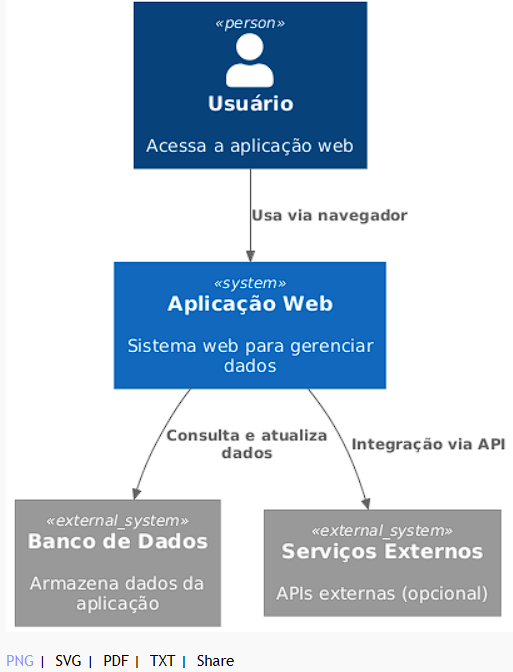
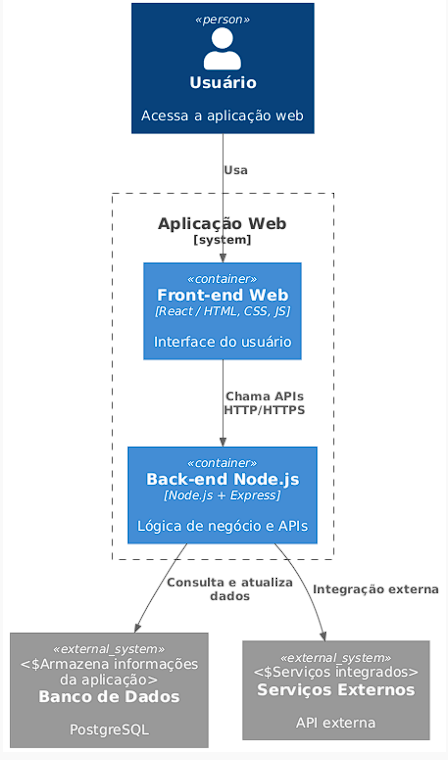

# Arquitetura do Projeto

## 1. Resumo do Sistema
O projeto é uma aplicação web que permite [descreva o objetivo do seu site].  
O usuário acessa via navegador, interage com a interface e envia dados para o back-end, que processa a lógica de negócio e se comunica com o banco de dados.

## 2. Tecnologias Escolhidas
- **Front-end:** React / HTML, CSS, JavaScript  
- **Back-end:** Node.js + Express  
- **Banco de dados:** PostgreSQL  
- **Hospedagem:** GitHub Pages (front-end) + Render/Heroku (back-end)  
- **Versionamento:** Git + GitHub  

## 3. Arquitetura do Sistema
### Diagrama de Contexto

### Diagrama de Contêineres

## 4. Justificativa do Modelo
- A arquitetura cliente-servidor foi escolhida por ser adequada para aplicações web modernas.  
- Separar front-end e back-end permite manutenção e escalabilidade.  
- O uso de React e Node.js facilita desenvolvimento ágil.
