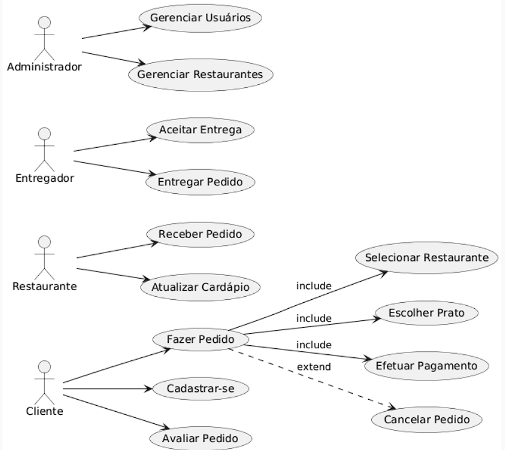

# 🍔 Sistema de Pedidos Online (Estilo iFood)

## 📖 Sobre o Projeto
Este projeto tem como objetivo desenvolver uma aplicação de pedidos online inspirada no iFood.  
A solução permitirá que clientes realizem pedidos em restaurantes parceiros, que sejam aceitos por entregadores, com gestão de usuários feita por administradores.  

O projeto será desenvolvido utilizando **Scrum**, com sprints quinzenais (TP1 a TP6), e toda a gestão será feita por meio do **GitHub Projects**.

---

## 🎯 Objetivo
Oferecer uma solução digital para facilitar o processo de **realização, gerenciamento e entrega de pedidos de comida**, conectando clientes, restaurantes e entregadores em um único ambiente.

---

## 📅 Planejamento (TP1 → TP2)
O planejamento do projeto está sendo realizado no **GitHub Projects**, onde os requisitos funcionais foram adicionados ao **Project Backlog**.  
As tarefas para o próximo sprint (TP2) estão listadas na coluna **TODO**.

---

## 👥 Atores Principais
- **Cliente**: realiza pedidos e avalia entregas.  
- **Restaurante**: recebe pedidos e atualiza cardápio.  
- **Entregador**: aceita e entrega pedidos.  
- **Administrador**: gerencia usuários e restaurantes.  

---

## 📊 Diagrama de Caso de Uso

O diagrama acima foi elaborado utilizando **PlantUML**.  
O código fonte está disponível em [`docs/casos_de_uso.puml`](casos_de_uso.puml).

"Este projeto foi estruturado seguindo boas práticas de arquitetura de software. Você pode visualizar os diagramas C4 e os detalhes técnicos 
Para compreender melhor as decisões arquiteturais e os diagramas C4 que sustentam este projeto, consulte a documentação completa clicque no link abaixo

